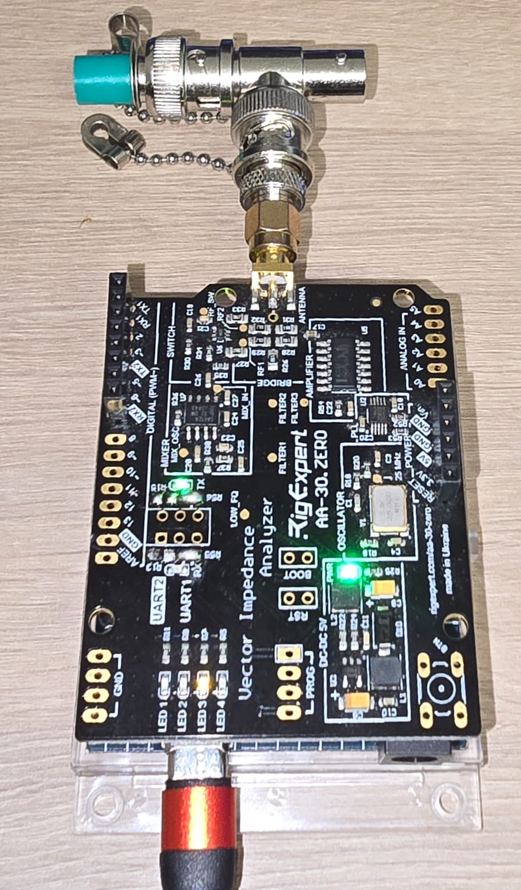

# Uno R4 Minima / RigExpert AA-30.ZERO SWR Meter

A bridge between an **Arduino Uno R4 Minima** and a **RigExpert AA-30.ZERO** antenna/cable
analyzer to measure and display Standing Wave Ratio (SWR), Resistance (R) and Reactance (X)
across the HF amateur bands (160 m → 10 m). The AA-30.ZERO works as an Arduino shield
(UART @ 38400 baud) and is a 5 V device.



## ✅ Status

- **Communication verified working** (`ver` → `AA-30.ZERO 200`, `fq`/`sw` → `OK`, `frx` → `freq,R,X` stream).
- Accurate measurement confirmed with a **50 Ω reference load** across all bands (R ≈ 50 Ω, SWR ≈ 1.0).
- Data validation guard in place to reject bogus readings (NaN/Inf, `R`/`|X|` > 1 MΩ, SWR out of range).
- Full 160 m → 10 m sweep recorded and graphed (IARU **Region 1** bands, 100 points/band).
- 🖥️ **Display selected**: Waveshare 2.4" SPI LCD (ILI9341, 240×320, 65K colour), 3.3 V logic.
- 🎛️ **Controls + UI wired**: four push buttons + live SWR curve / numeric readout on the display.

## 🛠️ Hardware

| Component | Role |
|-----------|------|
| **Uno R4 Minima** (Renesas RA4M1) | Main controller |
| **AA-30.ZERO** | RF analyzer, 0.06–30 MHz, UART @ 38400 |
| **waveshare 2.4" SPI LCD** (ILI9341, 240×320, 65K colour) | Display |
| **Logic level converter** (LEVEL-8P / TXS0108E, 8-ch) | Shifts R4 5 V SPI → display 3.3 V |
| **HU1–HU8 adapter board** | In-line breakout between converter and display |
| **4 × push buttons** | START (D2), BAND (D3), MODE (D4), CAL (D5) |

### Wiring (AA-30.ZERO UART1 → Uno R4)
The AA-30.ZERO has two UARTs. On the R4, the **only reliable path** is hardware `Serial1`
(D0/D1), which connects to the analyzer's **UART1** interface:

```
AA-30.ZERO UART1 TX  ->  Uno D0  (Serial1 RX)
AA-30.ZERO UART1 RX  ->  Uno D1  (Serial1 TX)
AA-30.ZERO GND       ->  Uno GND (common ground required)
```

> ⚠️ The R4's `SoftwareSerial` cannot initialize on D4/D7 (the analyzer's default UART2),
> so UART1 + hardware `Serial1` is used. The analyzer must be set to **UART1**.

### Wiring (Display SPI → Uno R4, via logic-level converter)
The Waveshare 2.4" SPI module is an ILI9341 on 4-wire SPI. The controller runs at **3.3 V**
but the R4's pins output **5 V**, so all five logic signals go through an **8-channel
bi-directional level converter** (LEVEL-8P / TXS0108E: `LV` side = 3.3 V, `HV` side = 5 V).
Power, ground and backlight are wired directly, no conversion needed.

```
Display 7-pin  Display pin   Level-8P            Uno R4
-------------  -----------   ------------------  -------------------
VCC            VCC (3.3V)    -                   Uno 3.3V (direct, no shift)
GND            GND           common GND          Uno GND (direct)
DIN            DIN (MOSI)    LV A1  <-  HV B1    Uno D11 (SPI COPI)
CLK            CLK (SCK)     LV A2  <-  HV B2    Uno D13 (SPI SCK)
CS             CS            LV A3  <-  HV B3    Uno D10 (chip select)
DC             DC            LV A4  <-  HV B4    Uno D9
RST            RST           LV A5  <-  HV B5    Uno D8
BL             BL            -                   Uno 3.3V (or D9 PWM for dimming)

Level-8P power:  LV side -> Uno 3.3V   |   HV side -> Uno 5V   |   GND common
```

> ✅ **Pin check** — the AA-30 uses D0/D1 (Serial1) and the buttons use D2–D5. The display
> occupies D8–D13, so there is **no overlap**.
>
> 🔌 **Signal routing** — DIN/CLK/CS/DC/RST each pass through one channel of the converter,
> LV side toward the display (3.3 V), HV side toward the R4 (5 V). Keep the 3.3 V-side wires
> short (<5 cm) to avoid overshoot on the TXS0108E.
>
> The **HU1–HU8 adapter board** is mounted in-line between the converter's LV side and the
> display, passing the five signals plus VCC/GND straight through (its `TX/RX/GND` silkscreen
> labels are not used for this SPI hook-up).

### Wiring (Buttons → Uno R4)

Four momentary push buttons, **INPUT_PULLUP** (pressed = LOW), debounced in firmware
(~25 ms). They read directly at 5 V; no level shifting required.

```
START  ->  D2   (start a scan of the current band)
BAND   ->  D3   (cycle through the HF bands)
MODE   ->  D4   (toggle display layout: curve / numeric)
CAL    ->  D5   (run a one-off calibration scan)
```

## 📡 Communication Protocol

| Command | Description | Response |
|---------|-------------|----------|
| `ver` | Return analyzer type and firmware version. | `AA-30.ZERO XXX` |
| `fqXXXXXXXXXX` | Set center frequency (Hz). | `OK` |
| `swXXXXXXXXXX` | Set sweep range (Hz). | `OK` |
| `frxNNNN` | Perform NNNN steps (NNNN+1 points). | `freq,R,X\n` per point, then `OK` |

Commands and responses are ASCII on UART @ **38400 baud**. `ver` returns `AA-30.ZERO 200`; a
scan outputs CSV lines `frequency(MHz),R,X` ending in `OK`. Practical max ≈ **700 points** per sweep.

See [`docs/AA-30_ZERO_data_exchange_protocol.md`](docs/AA-30_ZERO_data_exchange_protocol.md).

## 💾 Software

- **`src/AA30_Bridge.ino`** — serial bridge + state machine. Parses and validates the
  `freq,R,X` stream, computes SWR, stores valid points in `scanPoints[]`, then renders them
  to the ILI9341 display (SWR curve or numeric readout) and reads the four buttons.
  Built with **PlatformIO** + Arduino framework (requires **Adafruit_GFX** and
  **Adafruit_ILI9341**, declared automatically in `platformio.ini`).
- **`python/`** — `sweep_bands.py` (drive the analyzer + record results) and
  `graph_results.py` (render PDF graphs with matplotlib).

## 📊 Results & Graphs

Sweep results (IARU Region 1, 100 points/band, 50 Ω load):

| Band | R (Ω) | X (Ω) | Min SWR |
|------|-------|-------|---------|
| 160 m | ~50.4 | ~0 | 1.00 |
| 80 m | ~50.4 | ~0 | 1.01 |
| 60 m | ~50.4 | ~0 | 1.01 |
| 40 m | ~50.4 | ~0 | 1.01 |
| 30 m | ~50.4 | ~0 | 1.01 |
| 20 m | ~50.4 | ~0 | 1.01 |
| 17 m | ~50.4 | ~0 | 1.00 |
| 15 m | ~50.4 | ~0 | 1.02 |
| 12 m | ~50.4 | ~0 | 1.02 |
| 10 m | ~50.4 | ~0 | 1.02 |

- Full tables: [`result.md`](result.md) · raw data: [`result_data.json`](result_data.json)

### Graphs (SWR vs Frequency, PDF)
- [`graphs/160m.pdf`](graphs/160m.pdf) · [`80m.pdf`](graphs/80m.pdf) · [`60m.pdf`](graphs/60m.pdf) ·
  [`40m.pdf`](graphs/40m.pdf) · [`30m.pdf`](graphs/30m.pdf) · [`20m.pdf`](graphs/20m.pdf) ·
  [`17m.pdf`](graphs/17m.pdf) · [`15m.pdf`](graphs/15m.pdf) · [`12m.pdf`](graphs/12m.pdf) · [`10m.pdf`](graphs/10m.pdf)
- Combined, all bands in one PDF: [`graphs/AA-30_ZERO_all_bands.pdf`](graphs/AA-30_ZERO_all_bands.pdf)

## 🖼️ Media

See the assembly photo above. Demo video: [AA-30.ZERO demo](media/aa30_zero_demo.mp4)

## 📚 Documentation (`docs/`)

- [`AA-30_ZERO_schematics_and_drawings.pdf`](docs/AA-30_ZERO_schematics_and_drawings.pdf) — official schematics & BOM
- [`AA-30_ZERO_pcb_top.jpg`](docs/AA-30_ZERO_pcb_top.jpg) / [`AA-30_ZERO_pcb_bottom.jpg`](docs/AA-30_ZERO_pcb_bottom.jpg) — PCB drawings
- [`AA-30_ZERO_data_exchange_protocol.md`](docs/AA-30_ZERO_data_exchange_protocol.md) — command protocol
- [`AA-30_ZERO_getting_started.md`](docs/AA-30_ZERO_getting_started.md) — board overview & Arduino pairing
- `docs/display_wiring.pdf` — display + button wiring reference (Waveshare 2.4" SPI / ILI9341)

## 🔨 Build / Upload

The firmware is built with **PlatformIO** (Arduino framework, board `uno_r4_minima`):

```sh
pio run                  # compile
pio run -t upload        # flash over USB/DFU
pio run -t monitor       # serial monitor @ 115200
```

Config: [`platformio.ini`](platformio.ini); source: `src/AA30_Bridge.ino`. The Adafruit
GFX + ILI9341 libraries are pulled automatically via `lib_deps`.

USB CDC console: 115200 baud. AA-30 UART: 38400 baud (`Serial1`).

## 🚀 Next Steps

1. Verify the ILI9341 rendering + four-button workflow on real hardware.
2. Tighten the state machine (**IDLE → CALIBRATE → SELECT_BAND → SCANNING → DISPLAYING**).
3. Split CAL into a true self-calibration sequence (open/short/load reference), not just a re-scan.
4. Add touch / rotary control or a menu system for band and mode selection.

## License

MIT — see [`LICENSE`](LICENSE).
